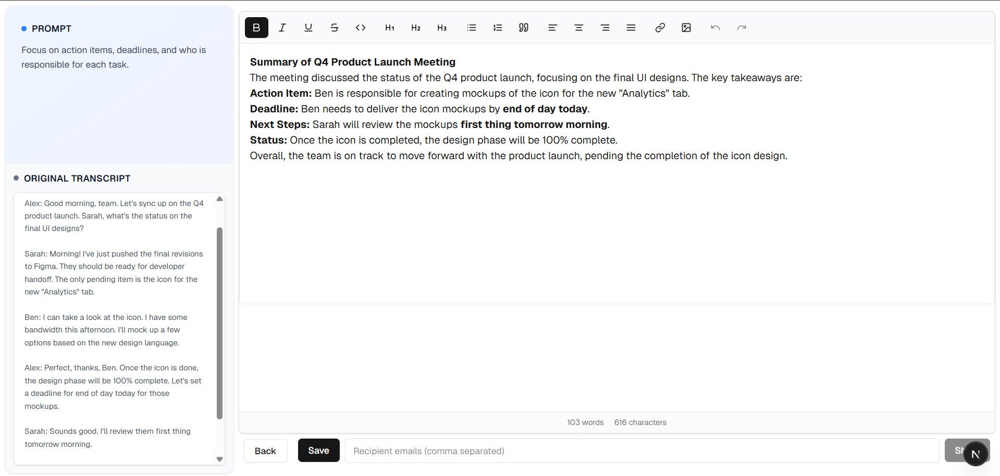
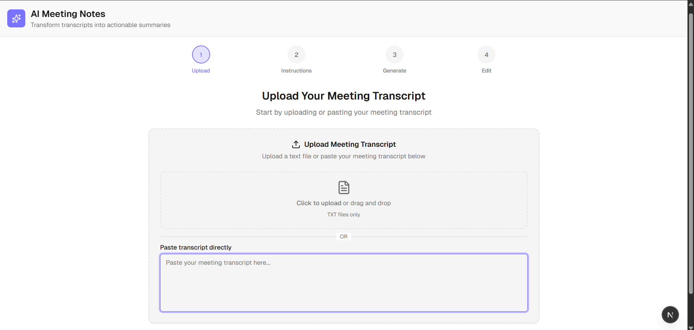
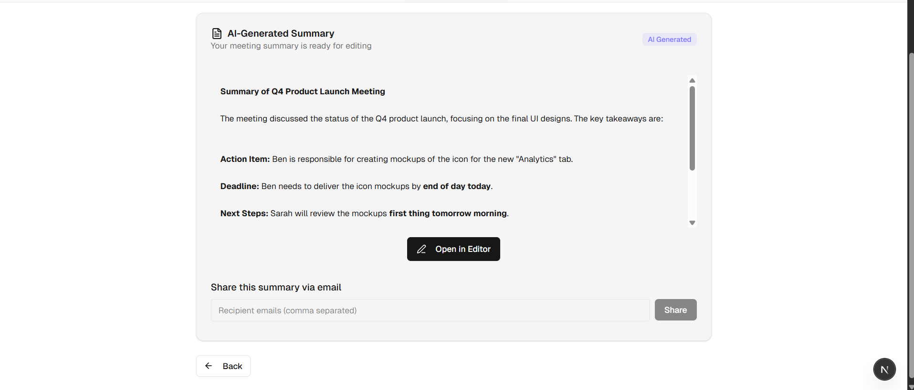

## Approach & Process

### Problem Statement

Build an AI-powered meeting notes summarizer and sharer. The user uploads a transcript, provides a custom prompt, generates an AI summary, edits it, and shares it via email.

## Screenshots

### Editor View



### Home View



### Summary



### Solution Overview

- **Step 1: Transcript Upload**  
  The user pastes or uploads a meeting transcript.
- **Step 2: Custom Prompt**  
  The user enters a custom instruction (e.g., "Summarize in bullet points for executives").
- **Step 3: AI Summary Generation**  
  On clicking "Generate Summary", the transcript and prompt are sent to the backend, which uses Groq's LLM API to generate a summary.
- **Step 4: Edit Summary**  
  The summary is displayed in a rich text editor for further editing.
- **Step 5: Share via Email**  
  The user enters recipient emails and shares the summary via SendGrid.

### Process & Reasoning

- **User Experience:**  
  The flow is broken into clear steps for simplicity and usability.
- **Backend API:**  
  Each step is mapped to a RESTful API endpoint for clarity and separation of concerns.
- **Persistence:**  
  Summaries and share logs are stored in PostgreSQL for auditability and future reference.
- **Rate Limiting:**  
  Upstash Redis is used to prevent API abuse and ensure fair usage.
- **Error Handling:**  
  All errors (including rate limits) are surfaced to the user via toast notifications, never as full-page errors.

### Why This Stack?

- **Next.js 14:**  
  Modern, full-stack framework with great developer experience and built-in API routes and easy monorepo structure for managing and scaling via providing easy shadcn ui supports and great edge caching & other benifits.
- **TypeScript & zod:**  
  Ensures type safety and maintainability, zod for validation.
- **Prisma & PostgreSQL:**  
  Fast, reliable, and easy-to-use ORM and database for structured data.
- **Groq API:**  
  Fast, cost-effective LLM for summarization.
- **SendGrid:**  
  Reliable transactional email delivery.
- **Upstash Redis:**  
  Serverless, scalable rate limiting.
- **shadcn/ui & Tailwind CSS:**  
  Minimal, accessible UI components for rapid prototyping.
- **Lexical Editor:**  
  Modern, extensible rich text editing for summary editing using tiptap.

---

## Tech Stack

- **Frontend:** Next.js 14, React 19, TypeScript, Tailwind CSS, shadcn/ui, Lexical
- **Backend:** Next.js API Routes, Prisma ORM
- **Database:** PostgreSQL
- **AI:** Groq API (LLaMA models)
- **Email:** SendGrid
- **Rate Limiting:** Upstash Redis
- **Deployment:** Vercel

## API Endpoints

### `/api/summarize`

**POST**

- **Description:** Generate a summary from a transcript and prompt using Groq API.
- **Body:**
  ```json
  {
    "transcript": "string",
    "prompt": "string"
  }
  ```
- **Response:**
  ```json
  {
    "id": "summaryId",
    "content": "AI-generated summary",
    "createdAt": "timestamp",
    "updatedAt": "timestamp"
  }
  ```

---

### `/api/saveSummary`

**PUT**

- **Description:** Save or update a summary’s content.
- **Body:**
  ```json
  {
    "id": "summaryId",
    "content": "edited summary"
  }
  ```
- **Response:**
  ```json
  {
    "id": "summaryId",
    "content": "edited summary",
    "updatedAt": "timestamp",
    "message": "Summary saved successfully!"
  }
  ```

---

### `/api/share`

**POST**

- **Description:** Share a summary via email to one or more recipients.
- **Body:**
  ```json
  {
    "summaryId": "summaryId",
    "summary": "summary content",
    "recipients": ["email1@example.com", "email2@example.com"]
  }
  ```
- **Response:**
  ```json
  {
    "message": "All emails sent successfully",
    "results": [
      { "recipient": "email1@example.com", "status": "success", "error": null },
      { "recipient": "email2@example.com", "status": "success", "error": null }
    ]
  }
  ```

---

## Data Persistence & Future Scalability

### Summaries and Shares

- **Every summary and share action is saved in the database.**
- This enables future features such as:
  - User authentication and summary ownership
  - Viewing/editing past summaries
  - Auditing and analytics of sharing activity
  - Logging for compliance and troubleshooting

### Prisma Schema Design

```prisma
model Summary {
  id         String   @id @default(cuid())
  createdAt  DateTime @default(now())
  updatedAt  DateTime @updatedAt
  transcript String
  prompt     String
  content    String
  shares     Share[]
}

model Share {
  id         String   @id @default(cuid())
  createdAt  DateTime @default(now())
  summaryId  String
  recipients String
  status     String
  error      String?
  Summary    Summary   @relation(fields: [summaryId], references: [id], onDelete: Cascade)
}
```

#### **Scalability & Extensibility**

- **User Management:**  
  The schema can be extended with a `User` model and a relation to `Summary` for multi-user support and authentication and can be used for analytics pov.
- **Logging & Auditing:**  
  The `Share` model logs every share attempt, including status and error, supporting compliance and analytics.
- **Future Features:**
  - Full dashboard for users to manage their summaries and sharing history
  - Team/workspace support
  - Advanced analytics on summary usage and sharing
  - Integration with other communication channels (Slack, Teams, etc.)
- **Collaborative Sharing:**  
  The API and schema can support collaborative sharing via `/summaries/:id` endpoints, allowing users to share and access the same summary link. This is not fully implemented in the prototype, as authentication is not set up for this assignment demo, but the foundation is in place for future expansion.

---

## Summary

- **All summaries and shares are persisted for future management and analytics.**
- **API endpoints are RESTful and ready for integration with a full-featured frontend.**
- **The database schema is designed for easy extension to support authentication, logging, and advanced features as the product grows.**
- **Collaborative and link-based sharing can be added easily in the future.**
- \*\*This prototype is focused on assignment requirements and does not include authentication or full user management, but is structured for future

## Security Headers

This application is configured with strict HTTP security headers in `next.config.ts` to help protect users and data:

- **Content-Security-Policy (CSP):**  
  Restricts the sources from which scripts, styles, images, fonts, etc. can be loaded. This helps prevent XSS attacks.

  - Only allows resources from `'self'` (the same origin), with limited exceptions for inline scripts/styles and avatar images.

- **X-Frame-Options: DENY**  
  Prevents the site from being embedded in iframes, protecting against clickjacking.

- **X-Content-Type-Options: nosniff**  
  Prevents browsers from MIME-sniffing a response away from the declared content-type, reducing exposure to drive-by downloads and XSS.

- **Referrer-Policy: no-referrer**  
  Ensures that no referrer information is sent with requests, protecting user privacy.

- **Strict-Transport-Security:**  
  Forces browsers to use HTTPS for all connections to the site, including subdomains, for two years.

- **Permissions-Policy:**  
  Disables access to sensitive APIs like microphone and camera.

These headers are set globally for all routes, providing a strong
